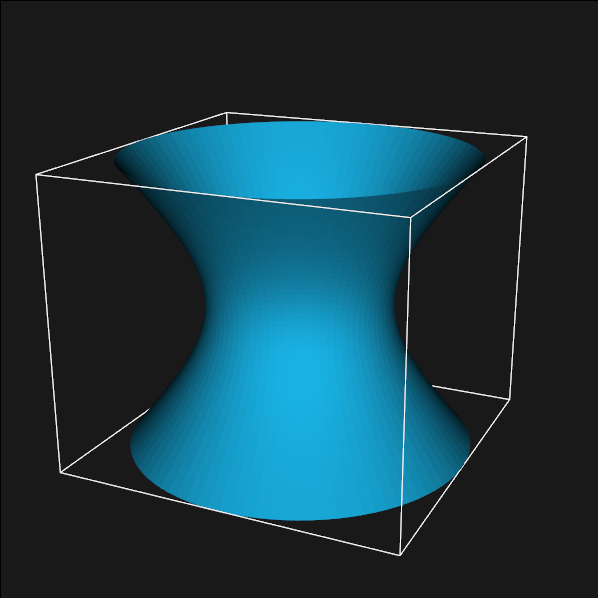
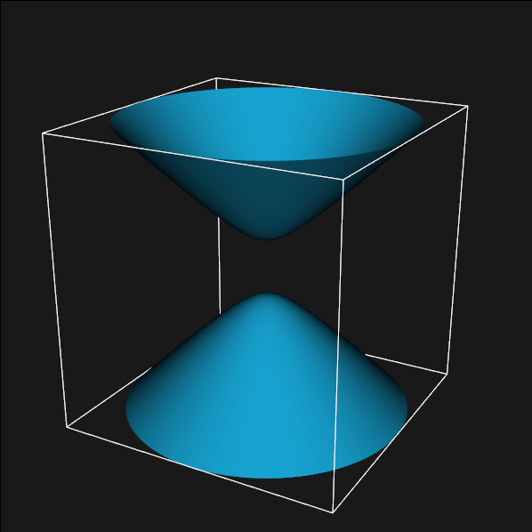
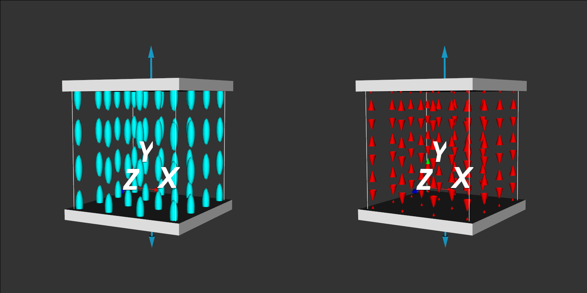

Deformable Image Registration Glyphs for Insights into Patterns of Local Tension and Compression
================================================================================================

.. role:: raw-latex(raw)
  :format: latex

Introduction
------------

When performing a deformable image registration on medical images, the end
result we are often interested in is the spatial distribution of deformation.
In particular, we are most interested in the non-rigid deformations.  That
is, we do not care as much about the rigid body translations, which often
dominate displacement field content, but the local stretching, compression, and
shearing that occurs.  These quantities are quantified in the strain tensor,
which can be derived from the displacement field.  The strain tensor is a
symmetric second rank tensor that is a function of derivatives of the
displacement field.  It is a true tensor in that it is invariant to the
coordinate system that is used to specify its components.

Ellipsoids are often used to represent the symmetric second rank diffusion
tensor image when DTI is performed.  The ellipsoid representation emerges
because of the equation

.. raw:: latex

  \[ \frac{x_1^2}{\lambda_1^2} + \frac{x_2^2}{\lambda_2^2} + \frac{x_3^2}{\lambda_3^2} = 1 \]

where :raw-latex:`$\lambda_1 , \, \lambda_2, \, \lambda_3$` are the eigenvalues
of the diffusion tensor.  This quadric representation of the diffusion tensor is
also the equation of an ellipsoid.  With the ellipsoid orientated by the
eigenvectors and the stretching along each direction determined by the
eigenvalues, the ellipsoid succinctly represents the nine components of the
diffusion tensor.

In the past, ellipsoid glyphs have also been used to visualize strain fields.
Even though the strain tensor is also a real, symmetric second rank tensor,
the ellipsoid representation is not strictly appropriate.
Unlike the diffusion tensor, the eigenvalues of the strain tensor are not always
positive.  The physical nature of diffusion and the 2nd Law of Thermodynamics
guarantee that the eigenvalues will always be positive.  In the case of strain,
a negative eigenvalue physically corresponds to compression in that direction,
and a positive eigenvalue corresponds to stretching or tension in that
direction.  The equation with one negative value,

.. raw:: latex

  \[ \frac{x_1^2}{\lambda_1^2} + \frac{x_2^2}{\lambda_2^2} - \frac{x_3^2}{\lambda_3^2} = 1 \]

is the equation for a hyperboloid of one sheet.

  Hyperboloid of one sheet.

With two negative eigenvalues, we have the equation for a hyperboloid of two
sheets.

.. raw:: latex

  \[ - \frac{x_1^2}{\lambda_1^2} - \frac{x_2^2}{\lambda_2^2} + \frac{x_3^2}{\lambda_3^2} = 1 \]

  Hyperboloid of two sheets.

Results
-------

VTK classes were created to generate hyperboloid's of one and two sheets.  A new
tensor glyph class was created to use the appropriate glyph based on the sign of
the eigenvalues and scale and orientate it appropriately.  The code is available
at http://kwsource.kitwarein.com/signed-tensor/vtk-signed-tensor.

.. figure:: images/strain_flavors_ellipsoid.png
  :scale: 40%

  Different eigenvalues and orientations with vtkTensorGlyph.

.. figure:: images/strain_flavors.png
  :scale: 40%

  Different eigenvalues and orientations with vtkSignedEigenvalueTensorGlyph.

Figures 4 shows how glyph appearance for different sets of
eigenvalues.  We see not only the orientation and magnitude, but the sign, i.e.
tensor or compression is immediately distinuishable.  The pattern is: if a
line through a given axis does not intersect the glyph, there was compression in
that direction.

When all three eigenvalues are negative, it is the equation for an "imaginary
ellipsoid".  Imaginary ellipoids are hard to draw (!), so a cube was used
instead.

The following figures illustrate a mechanical model of a uniform, solid
block being compressed or stretched with an unconstrained set of plates.
There is no difference between tension and compression for the ellipsoid-only
representation, while the difference is clear with the hyperboloids.

.. raw:: latex

  \newpage

  Uniaxial tension of a block and the corresponding strain tensor glyphs.

.. figure:: images/uniaxial_compression.png
  :scale: 40%

  Uniaxial compression of a block and the corresponding strain tensor glyphs.

Future Work
-----------

For a MICCAI paper, we could take your 4D cardiac registration displacement
fields, calculate the strain tensor image
(http://gitorious.org/itk-repos/itk-strain),
and the look at the strain tensor glyphs within a layer of the cardiac walls.
We can show that there is a clear difference between the systolic and diastolic
images not distinguishable in the ellipsoid-only image.  The ability to
distinguish between compression and extension along with orientation of
deformation should be a critical factor in the evaluation of cardiac
dyssynchrony, for example.  We could also show how the glyphs can be used to
display where and how deformation has occured relative to the reference image in
an inter-operative brain image setting.
